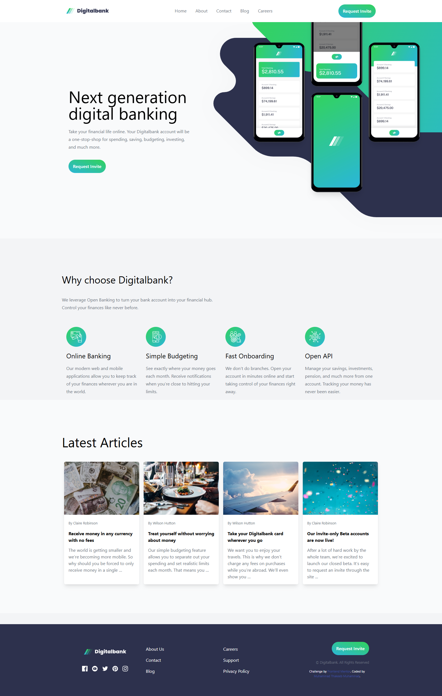
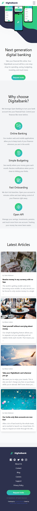

# Frontend Mentor - Digitalbank landing page solution

This is a solution to the [Digitalbank landing page challenge on Frontend Mentor](https://www.frontendmentor.io/challenges/digital-bank-landing-page-WaUhkoDN). Frontend Mentor challenges help you improve your coding skills by building realistic projects.

## Table of contents

- [Overview](#overview)
  - [The challenge](#the-challenge)
  - [Screenshot](#screenshot)
  - [Links](#links)
- [My process](#my-process)
  - [Built with](#built-with)
  - [What I learned](#what-i-learned)
  - [Continued development](#continued-development)
  - [Useful resources](#useful-resources)
  - [AI Collaboration](#ai-collaboration)
- [Author](#author)

## Overview

### The challenge

Users should be able to:

- View the optimal layout for the site depending on their device's screen size
- See hover states for all interactive elements on the page

### Screenshot

#### Desktop

#### Mobile

### Links

- Solution URL: [Add solution URL here](https://www.frontendmentor.io/solutions/responsive-digital-bank-landing-page-NBTiylmYvb)
- Live Site URL: [Add live site URL here](https://digital-bank-landing-page-2kzf.onrender.com/)

## My process

### Built with

- Semantic HTML5 markup
- Flexbox
- CSS Grid
- Mobile-first workflow
- Tailwind CSS

### What I learned

I learned how to use tailwind css to build responsive mobile first landing page

### Continued development

I hope to continue upskilling and master tailwind css and other web dev modern frameworks

### Useful resources

- [Resource](https://tailwindcss.com/docs) - This helped me in learning more about tailwind utility clases .

### AI Collaboration

Describe how you used AI tools (if any) during this project. This helps demonstrate your ability to work effectively with AI assistants.

- ChatGpt
- Debugging and understanding errors and how to solve them

## Author

- Website - [Muhammad Thakeeb Muhammad](https://mttechdesigns.vercel.app/)
- Frontend Mentor - [Thakeeb22](https://www.frontendmentor.io/profile/Thakeeb22)
- Twitter - [MuhammadThakeeb](https://x.com/MuhamadThakeeb)
